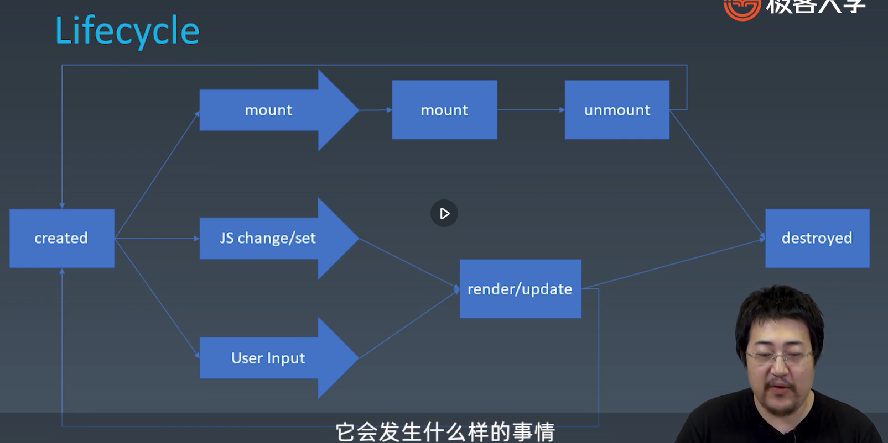

# 学习笔记 Week 13

## 组件的基础知识

### 组件的基本概念盒基本组成

#### 对象与组件

* 对象
  * Properties
  * Methods
  * Inherit
* 组件(和 UI 强相关，既是对象又是模块)
  * Properties (Component User's JS Code)
  * Methods
  * Inherit
  * Attribute (Component User's Markup Code)
  * Config & State
  * Event
  * Lifecycle
  * Childeren

#### Component

End User Input ->

Component

Stete

Childeren

<- attribute (组件使用者向开发者传递信息)

<- Method

<- Property

event -> (组件开发者向使用者传递信息)

#### Attribute VS Property

|Attribute|Property|
|-|-|
|强调描述性|强调从属关系|

Attribute:
```html
<my-component attribute="v" />
myComponent.getAttribute("a")
myComponent.setAttribute("a", "value")
```

Property:
```js
myComponent.a = "value";
```

例1：

```html
<!-- attribute 是 class -->
<div class="cls1 cls2"></div>
<script>
  var div = document.getElementByTagName('div');
  // Property 是 className
  div.className // cls1 cls2
</script>
```

例2：
```html
<!-- style 字符串 -->
<div class="cls1 cls2" style="color:blue"></div>
<script>
  var div = document.getElementByTagName('div');
  // style 字符串语义化后的对象
  div.style // 对象
</script>
```

例3：
```html
<a href= "//m.taobao.com"></div>
<script>
  var a = document.getElementByTagName('a');
  a.href// "http://m.taobao.com",这个 URL 是 resolve 过的结果
  a.getAttribute('href')// "//m.taobao.com", 跟 HTML、 代码中完全一致
</script>
```

例4：
```html
<input value="cute"/>
<script>
  var imput = document.getElementByTagName('input'); //若 property 没有设置，则记过是 attribute
  input.value // cute
  input.getAttribute('value'); //cute
  input.value 'hello'; // 若 value property 已经设置，则 attribute 不变， property 变化，元素上世界的效果是 property 优先
  input.value // hello
  input.getAttribute('value'); //cute
</script>
```

#### 如何设计组件状态

| Markup set | JS set | JS Change | User Input Change | |
| - | - | - | - | - |
| x | v | v | ? | property |
| v | v | v | ? | attribute |
| x | x | x | v | state |
| x | v | x | x | config |

property: 用户输入不应该改变 property

attribute： 用户输入不应该改变 attribue

state： 只能从组件内部改变，不能从外部改变。但保证用户输入是能改变我的 state 的

config: 一次性结果，只在构造是被触发，不可更改。通常留给全局

#### Lifecycle



#### Children

* Content 型 Children 与 Template 型 Children

```html
<!-- 普通 element -->
<my-button>{{title}}</my-button>

<!-- Angular 中的 ngFor 等等 -->
<my-list>
  <li>{{title}}</li>
</my-list>
```
#### 为组件添加 JSX 语法

```bash
mkdir jsx
cd jsx
npm init
npm install -g webpack webpack-cli
npm install --save-dev webpack babel-loader
vim webpack.config.js (entry)
webpack
npm install --save-dev @babel/core @babel/preset-env
vim webpack.config.js (module.rules: babel-loader: presets)
webpack
npm install --save-dev @babel/plugin-transform-react-jsx
vim webpack.config.js (moduel.rules: babel-loader: plugins)
```
